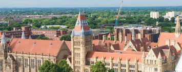

# manchester university

Manchester is a city and metropolitan borough of Greater Manchester, England, which had an estimated population of 568,996 in 2022. It contributes to the ...

## our courses

1. Humanities
English Literature
History
Philosophy
Religious Studies
Linguistics
2. Science
Biology
Chemistry
Physics
Environmental Science
Mathematics
3. Engineering
Mechanical Engineering
Civil Engineering
Electrical and Electronic Engineering
Aerospace Engineering
4. Business
Business Management
Marketing
Finance
Accounting
International Business
5. Social Sciences
Sociology
Politics
Social Work
Psychology
International Relations
6. Health and Medicine
Medicine
Nursing
Pharmacy
Public Health
Dentistry
7. Arts
Fine Arts
Music
Theatre
Media Studies
8. Law
LLB Law
International Law
Human Rights Law

### our campus

The University of Manchester has a vibrant and diverse campus located in the heart of Manchester, one of the UK's most dynamic cities. Here are some key features of the campus:

* Architecture
The campus features a mix of historic and modern buildings, including iconic structures like the Whitworth Hall and the newly developed buildings for science and engineering.
* Facilities
Libraries: The main library is extensive, providing a range of study spaces, resources, and technological support.
Laboratories: State-of-the-art labs for science, engineering, and medical students, equipped with the latest technology.
Sports Facilities: A wide range of sports facilities, including gyms, sports halls, and outdoor pitches.
* Green Spaces
The campus includes green areas, gardens, and open spaces, perfect for relaxation and socializing.
* Student Support Services
Comprehensive support services are available, including academic advising, mental health support, and career services.
* Cultural Activities
The university hosts various events, exhibitions, and performances throughout the year, enriching the student experience.
* Community and Diversity
The campus is home to a diverse student body from around the world, promoting a rich cultural exchange and a sense of community.
* Transport Links
Well-connected by public transport, with easy access to the city center and beyond, making it convenient for students to explore Manchester.

 